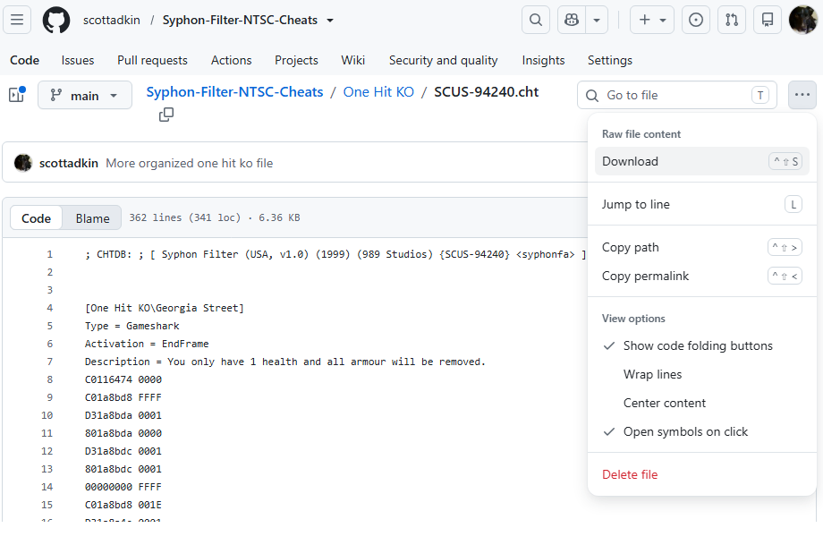
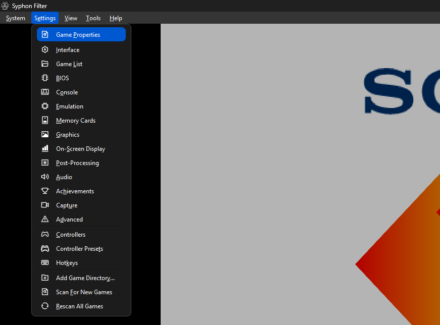
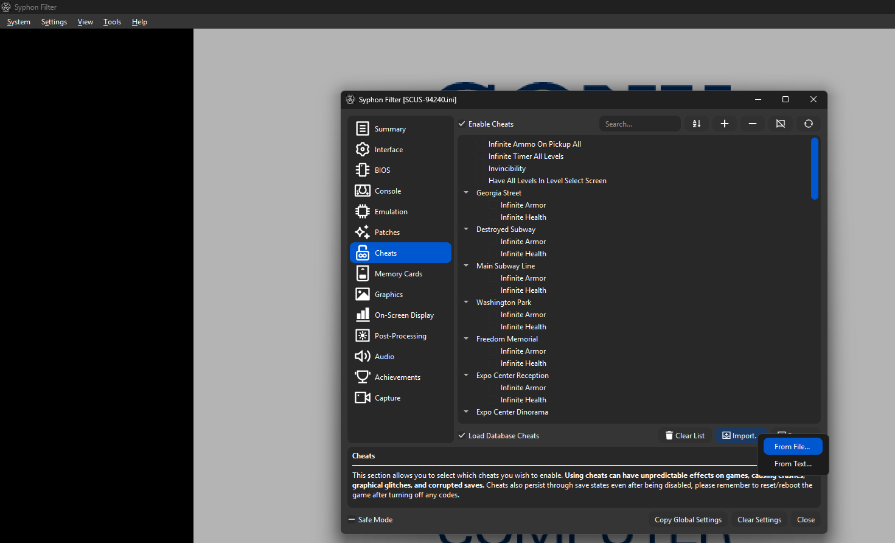
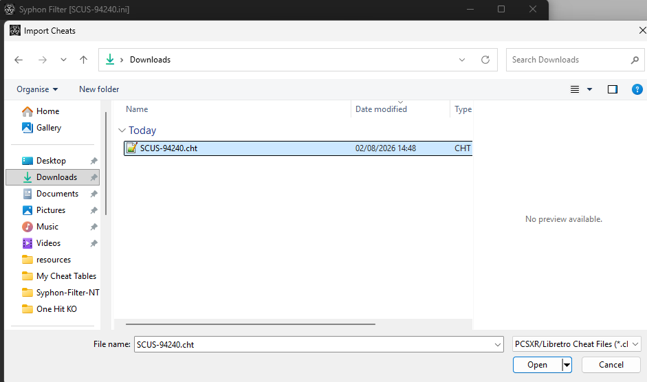
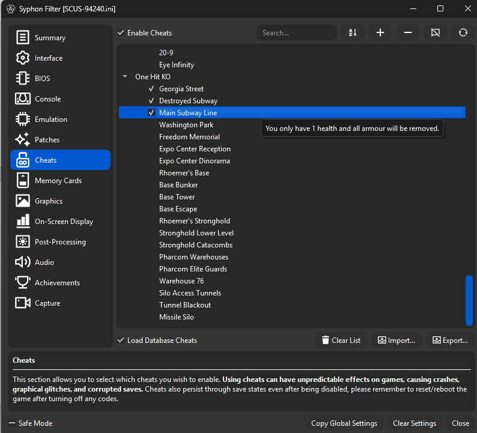

# One HIT KO Cheat(NTSC)
Forces your max health to 1, if you pick up any armour it will be reset back to 0.

Each cheat checks to see if you are on the correct mission, if you are not it won't run to prevent issues with other memory addresses being overridden.

# Duckstation Install
- Download the cheat file from https://github.com/scottadkin/Syphon-Filter-NTSC-Cheats/blob/main/One%20Hit%20KO/SCUS-94240.cht

- Run Duckstation
- Launch Syphon Filter NTSC
- Open Duckstations Game Properties Window

- Go to the cheats tab, click the import and then click import from file.

- Select the downloaded file and click open.

- You should now see a new cheat group called "One Hit KO", you can now tick the levels you want to cheat active.

